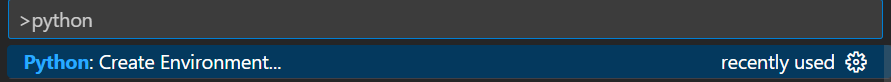
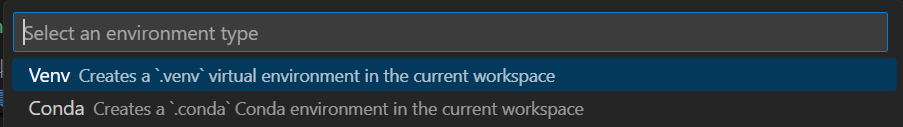
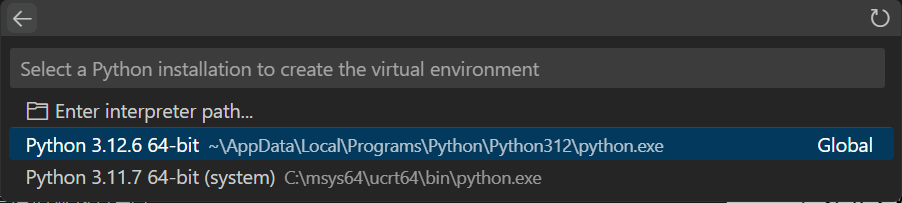
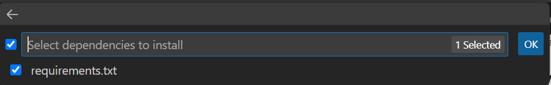
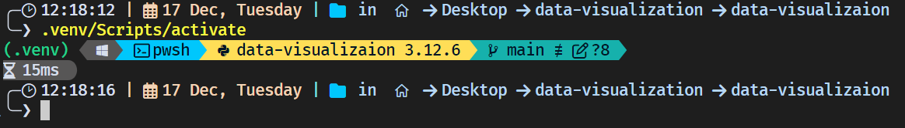
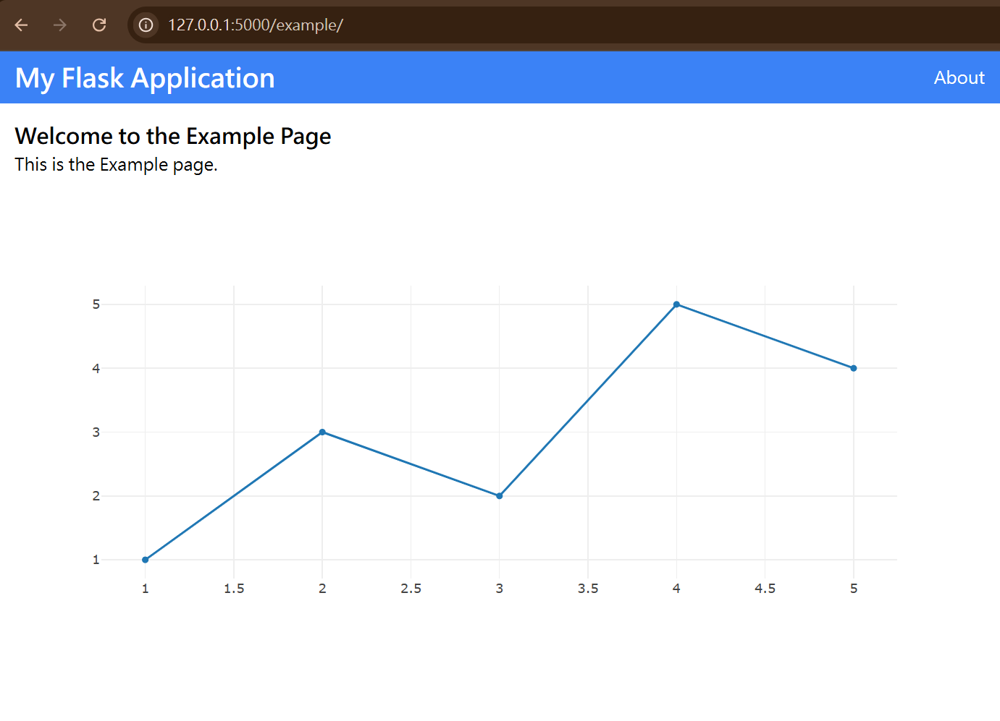

# **資料視覺化專案**


/pages裡面的readme寫的圖表只是大概規劃一下而已，僅供參考。
注意一下資料裡面 有些項目像是`住宅服務、水電瓦斯及其他燃料`其實是`住宅服務`,`水電費及燃料`的加總 使用的時候要注意一下


## **開始使用**

按照以下步驟設定環境並執行專案：
1. 拉取專案
```bash
   git pull https://github.com/ATREE01/data-visualizaion.git
```

2. **建立 Python 環境**  
python版本3.12
使用vscode建立python venv
在`vscode`當中按下`ctrl` + `shift` + `p`




接下來在terminal執行
```bash
.venv\Scripts\activate # windows
source .venv\Scripts\activate # Linux\Mac
```

應該會看到旁邊有個(.venv)
3. 執行專案

```bash
pythom -u app.py
```
   務必確保是在有啟動venv的terminal執行app.py不然可能會出現找不到dependencies的錯誤

順利執行的話應該會可以在`http://127.0.0.1:5000/example`看到下面這樣


---

## **專案結構**

- **`app/`** - Flask 應用程式的程式碼。  
- **`pages/`** - 各個頁面的內容與邏輯。  
- **`static/`** - 靜態檔案 (CSS, JavaScript, 圖片等)。  
- **`templates/`** - HTML 模板檔案。  
- **`requirements.txt`** - Python 依賴套件清單。  

---

## **GitHub 流程** *(如果使用 GitHub 的話)*

1. **建立新分支**  
   執行以下指令：
   ```bash
   git checkout -b {你的分支名稱}  # 創建並切換到新的 branch
   ```

2. **新增你的修改**  
   - 修改內容時，盡量避免改到其他人的部分。
     
   - 範例指令：  
     ```bash
     #如果不知道怎麼使用的話可以查一下怎麼在VScode使用git或是問ChatGPT
     git add .         # 暫存變更
     git commit -m "你的提交訊息"  # 提交修改
     ```

3. **推送到 GitHub 並發 Pull Request**  
   將你的分支push到 GitHub，然後建立一個 Pull Request。

---

## **開發流程**

### 1. 在 `pages/` 中建立新頁面資料夾
- 創建一個新的資料夾 (例如 `example`)。  
- 複製現有頁面中的 `index.py` 檔案，並進行修改。  

**範例：`index.py`**  
```python
from flask import render_template, Blueprint

# 定義 Blueprint
example_blueprint = Blueprint('example', __name__)

# 新增路由
@example_blueprint.route('/')
def example():
    return render_template('example.html')
```

---

### 2. 在 `templates/` 和 `static/` 中建立相關檔案
- 新增你的 **HTML**, **CSS**, 和 **JS** 檔案。
- 可以參考 example 的 file
- 注意head的部分要Import plotly，如果要使用TailwindCSS的話也要Import他
```html
<html>
<head>
  <meta charset="UTF-8">
  <meta name="viewport" content="width=device-width, initial-scale=1.0">
  <script src="https://cdn.plot.ly/plotly-2.24.1.min.js"></script>
  <script src="https://cdn.tailwindcss.com"></script>
</head>

```
---

### 3. 在 `app.py` 中註冊 Blueprint
- 在主程式 `app.py` 中導入並註冊 Blueprint：

```python
from pages.example.index import example_blueprint

# 註冊 Blueprint
app.register_blueprint(example_blueprint, url_prefix='/example')
```

**說明**：  
- `url_prefix` 會加在該 Blueprint 所有路由的前面。  
- 例如，`index.py` 中定義了 `'/'`，那麼頁面會顯示在：  `http://127.0.0.1:5000/example/`

---

### 4. 執行專案
確認已啟動虛擬環境，執行以下指令：  
```bash
python app.py
```

- 如果沒有錯誤，應該能順利運行專案。  
- 使用瀏覽器打開 `http://127.0.0.1:5000/` 測試你的頁面。

---

#### 額外備註

在專案當中CSS的部分可以使用Tailwind css這個工具，透過把class的方式去寫style，可以增加可讀性。最重要的是可以很簡單的讓ChatGPT幫你設計頁面，以下是一個簡單的prompt，或是乾脆截圖讓他幫你用TailwindCSS設計相同的頁面出來。

想要用甚麼style可以在下面這個網址搜尋
https://tailwindcss.com/

```
prompt: 請使用TailwindCSS幫我設計一個XXX頁面
```
但如果覺得太麻煩的話還是可以就在css資料夾裡面創一個css檔案然後用上課教的方式去Import他

## **注意事項**

1. **更新 `requirements.txt`**  
   如果有安裝新的套件，請更新依賴檔案：  
   ```bash
   pip freeze > requirements.txt
   ```

2. **啟動虛擬環境**  
   如果執行不了的話可能是虛擬環境的問題，記得啟動虛擬環境，參照最前面文件開頭 
